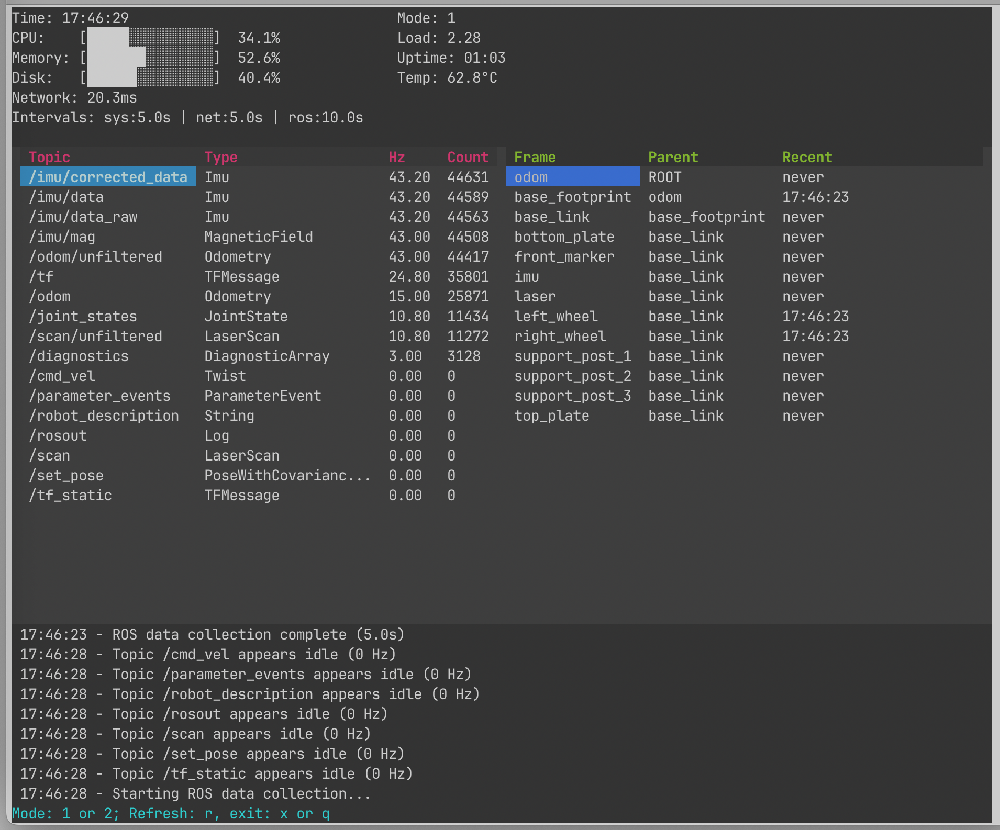

# ROS2 System Monitor

A terminal-based system monitor for ROS2 environments with real-time system metrics, ROS node/topic monitoring, and TF frame tracking.

## Current Status

* Version 0.2 - Active development with selective topic display features
* Verified to work on Ubuntu 24.04 with ROS2 Jazzy
* Requires separate installation of python library textual


## Installation

### Prerequisites
- ROS2 (Humble, Iron, or Jazzy)
- Python 3.8+
- Python library textual

### Installing textual
You may find that doing any pip install gives an error `error: externally-managed-environment`. In our case it happened with `pip install textual`. You can work around this with `pip install textual --break-system-packages`. Note: This bypasses Python environment isolation - use with caution.

### Installing ros2sysmon

Like many other ROS2 apps:

```
cd ros2_ws/src
git clone https://github.com/pitosalas/ros2sysmon.git
```

### Build
```bash
cd ~/your_ros2_workspace
source /opt/ros/jazzy/setup.bash  # or your ROS2 distribution
colcon build --packages-select ros2sysmon
source install/setup.bash
```

## Usage

```bash
# Basic usage
ros2 run ros2sysmon ros2sysmon

# With options
ros2 run ros2sysmon ros2sysmon --config /path/to/config.yaml --refresh-rate 3.0
```

### Controls
- **`1`** - Topics + TF frames view
- **`2`** - ROS nodes + processes view  
- **`r`** - Manual refresh/collect data
- **`x`/`q`** - Exit

## Display

### Header Panel
System metrics with ASCII progress bars:
- CPU/Memory/Disk usage with visual bars
- Load average, uptime, temperature
- Network latency to 8.8.8.8

### Two Display Screens
1. **Screen 1**: ROS Topics (Hz, Count) + TF Frames
2. **Screen 2**: ROS Nodes + System Processes (filtered for ROS)

### Topic Display Features
- **Selective Display**: Configure which topics to show via `config_topics`
- **Hz Measurement Control**: Choose which topics to measure frequency for
- **Wildcard Support**: Use "*" to control behavior for unconfigured topics
- **Visual Indicators**: "--" shown for Hz/Count when measurement disabled

### Alerts Panel
System alerts with timestamps for threshold violations.

## Metric Calculations

### System Metrics
- **CPU**: `psutil.cpu_percent(interval=0.1)` - 100ms sampling
- **Memory**: `psutil.virtual_memory().percent` - available vs total
- **Disk**: `psutil.disk_usage('/').percent` - root filesystem usage
- **Temperature**: `psutil.sensors_temperatures()` - from `coretemp`/`cpu_thermal`
- **Load Average**: `psutil.getloadavg()[0]` - 1-minute load
- **Uptime**: `time.time() - psutil.boot_time()` formatted as HH:MM
- **Network Latency**: `ping -c 1 -W 2 8.8.8.8` parsed from output

### ROS Metrics
- **Nodes**: Discovered via `ros2 node list` (10s timeout)
- **Topics**: Discovered via `ros2 topic list -t` (5s timeout)
- **Topic Hz**:
  - Creates ROS2 subscribers only for topics with `measure_hz: true`
  - Collects message timestamps during windowed collection (default 3s)
  - Calculates frequency as: `message_count / collection_window_duration`
  - Shows 2 decimal precision or "--" when measurement disabled
- **TF Frames**: Retrieved via `tf2_ros.Buffer.all_frames_as_yaml()`
- **Processes**: Filters system processes for ROS-related keywords

### Target Frequencies (for alerts)
- `/cmd_vel`, `/twist`: 10Hz
- `/odom`: 30Hz  
- `/scan`, lidar topics: 10Hz
- `/image*`, camera topics: 30Hz
- `/imu`: 100Hz
- `/tf`: 100Hz

## Configuration

Default config: `config/default_config.yaml`

### Complete YAML Configuration Structure
```yaml
# Display settings
refresh_rate: 5.0           # Display update rate (seconds)
max_alerts: 10              # Maximum alerts to display
max_nodes_display: 15       # Maximum ROS nodes to show
max_topics_display: 10      # Maximum topics to show

# Collection intervals (seconds)
collection_intervals:
  system_metrics: 10.0      # CPU, memory, disk, temperature
  network_ping: 10.0        # Network latency checks
  ros_discovery: 30.0       # ROS node/topic discovery
  hz_collection_duration: 5.0  # Hz measurement window duration

# System alert thresholds
thresholds:
  cpu_warn: 70.0           # CPU usage warning (%)
  cpu_error: 85.0          # CPU usage error (%)
  memory_warn: 75.0        # Memory usage warning (%)
  memory_error: 90.0       # Memory usage error (%)
  disk_warn: 80.0          # Disk usage warning (%)
  disk_error: 95.0         # Disk usage error (%)
  temperature_warn: 70.0   # Temperature warning (°C)
  temperature_error: 85.0  # Temperature error (°C)
  network_latency_warn: 100    # Network latency warning (ms)
  network_latency_error: 500   # Network latency error (ms)

# ROS2 specific configuration
ros:
  # Topic-specific settings with granular control
  config_topics:
    - name: "/tf"
      target_frequency: 30.0  # Expected Hz for alerts
      measure_hz: true        # Enable Hz measurement
      display: true           # Show in topic list
    - name: "/scan"
      target_frequency: 20.0
      measure_hz: true
      display: true
    - name: "/cmd_vel"
      target_frequency: 1.0
      measure_hz: false       # Disable Hz measurement
      display: true
    - name: "/map"
      measure_hz: true        # No target_frequency = no alerts
      display: true
    - name: "/odom"
      measure_hz: true
      display: true

  # Node filtering patterns
  node_patterns:
    ignore:
      - "/_ros2cli_*"         # Ignore CLI nodes
      - "/launch_ros_*"       # Ignore launch nodes

# Display preferences
display:
  show_colors: true           # Enable colored output
  show_progress_bars: true    # Show ASCII progress bars
  time_format: "%H:%M:%S"     # Timestamp format
  panel_layout:
    screen_1: ["topics", "tfs"]      # Screen 1 layout
    screen_2: ["nodes", "processes"] # Screen 2 layout
    hidden: []                       # Hidden panels
```

### Topic Configuration Details
- **name**: Topic name or "*" wildcard for unconfigured topics
- **target_frequency**: Expected Hz for alert generation (optional)
- **measure_hz**: Enable/disable Hz measurement (`true`/`false`)
- **display**: Show topic in display (`true`/`false`)
- Topics without `measure_hz: true` show "--" for Hz and count
- Use manual refresh (`r` key) to update Hz measurements

## Architecture

- **Textual** framework for terminal UI
- **Threading**: Separate collectors for system, network, and ROS data
- **SharedDataStore**: Thread-safe data exchange
- **Manual/Timed Collection**: Configurable collection intervals

## Dependencies

**ROS2**: `rclpy`, `tf2_ros`, `rosidl_runtime_py`  
**System**: `psutil`, `pyyaml`, `textual`  
**Standard**: `subprocess`, `threading`, `dataclasses`

## License

MIT
